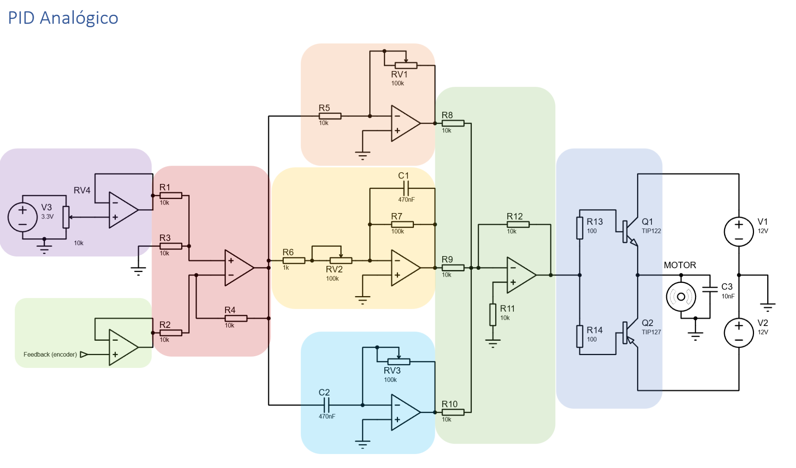
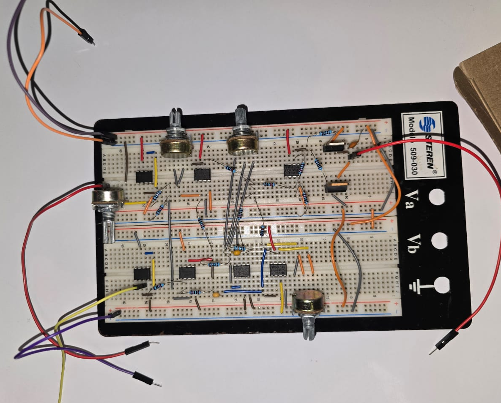

<div align="center">

# Analog and Digital PID Controllers for DC Motor Control

##### This repository contains the implementation of **Analog** and **Digital** PID controllers designed for controlling the position of a DC motor as part of a **Control Systems** class. The analog implementation uses operational amplifiers, potentiometers, resistors, and capacitors, while the digital implementation utilizes an **Arduino UNO** with feedback from a magnetic encoder.


</div>


## Table of Contents
1. [Analog PID Controller](#analog-pid-controller)
   - [Materials](#materials)
   - [Circuit Description](#circuit-description)
   - [Tuning Process](#tuning-process)
2. [Digital PID Controller](#digital-pid-controller)
   - [Repository Content](#repository-content)
   - [Project Description](#project-description)
   - [Requirements](#requirements)
   - [Usage Instructions](#usage-instructions)

---

## Analog PID Controller

### Materials
The analog PID controller circuit uses the following components:
- **Power Supply**: 3.3V and 12V sources to power operational amplifiers and the DC motor.
- **Operational Amplifiers (OpAmps)**: For implementing proportional, integral, and derivative blocks.
- **DC Motor**: The actuator controlled by the PID.
- **Magnetic Encoder**: Provides feedback for closed-loop control.
- **Potentiometers**:
  - **RV1, RV2, RV3**: 100kΩ potentiometers for adjusting proportional, integral, and derivative gains.
  - **RV4**: 10kΩ potentiometer for setting the reference signal.
- **Resistors**:
  - 10kΩ (R1–R5, R8–R12) for defining circuit constants and OpAmp gains.
  - 1kΩ (R6) for feedback.
  - 100kΩ (R7) for the integrative stage.
  - 100Ω (R13, R14) for limiting current in power transistors.
- **Capacitors**:
  - 470nF (C1, C2) for integral and derivative stages.
  - 10nF (C3) for motor signal filtering.
- **Transistors**:
  - **TIP122** (Q1): Amplifies the control signal to drive the motor.
  - **TIP127** (Q2): Complementary transistor for the same purpose.
- **Oscilloscope**: For visualizing and tuning system response.
- **Protoboard and Jumpers**: For circuit assembly and testing.

### Circuit Description
The analog PID controller is implemented using OpAmp circuits:
- **Proportional**: Adjusted using RV1.
- **Integral**: Configured with R7 and C1.
- **Derivative**: Configured with R7 and C2.
Feedback from the magnetic encoder provides the position signal, which is compared to the reference set by RV4 to compute the error. The output signal drives the motor through the power transistors.

### Tuning Process
The controller gains (proportional, integral, and derivative) were tuned manually using the potentiometers while observing the response on an oscilloscope. Adjustments were made to achieve the desired performance criteria, such as settling time and overshoot.


### Analog PID Gallery



---

## Digital PID Controller

### Repository Content

#### 1. **Arduino Codes**
Located in the `Arduino` folder:
- `PRBS_Generator.ino`: Generates a **Pseudo Random Binary Sequence (PRBS)** to collect system data.
- `PID_Controller.ino`: Implements the discretized PID controller with tuned gains for real-time motor control.

#### 2. **MATLAB Files**
Located in the `MATLAB` folder:
- `data_processing.m`: Processes data collected by Arduino and saves it as a CSV file.
- `system_identification.m`: Identifies the system's **transfer function** using MATLAB's System Identification Toolbox.
- `pid_tuner.m`: Tunes the PID controller using MATLAB's **PID Tuner**.

### Project Description

#### 1. **PID Implementation**
This project extends previous work on the analog PID by implementing a digital PID controller for enhanced precision and flexibility. Feedback from the magnetic encoder is used to compute the error, and the controller adjusts the motor position accordingly.

#### 2. **Plant Identification**
To accurately model the system, a PRBS signal was used to excite the plant. The system's response was recorded, processed in MATLAB, and identified as a second-order transfer function with 99.35% reliability.

#### 3. **PID Tuning**
Using the identified transfer function, MATLAB's PID Tuner was employed to calculate the optimal gains ($K_p$, $K_i$, and $K_d$), which were implemented in the Arduino code.

### Requirements
- **Arduino UNO** or compatible microcontroller.
- **MATLAB** with System Identification and PID Control Toolboxes.
- **Arduino IDE** for compiling and uploading the code.
- **Oscilloscope** or **Serial Plotter** to monitor signals.

### Usage Instructions
1. Clone this repository:
   ```bash
   git clone https://github.com/HumbertoBM2/AnalogAndDigitalPID.git
